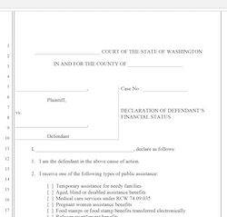

# Help

## Declaration of Financial Status Form

[{: align=right }](https://view.officeapps.live.com/op/view.aspx?src=https%3A%2F%2Fbeta.lfocalculator.org%2Fstatic%2Fmedia%2Ffinancial-status-declaration.26698d35.docx)

A [***Declaration of Financial Status form***](https://view.officeapps.live.com/op/view.aspx?src=https%3A%2F%2Fbeta.lfocalculator.org%2Fstatic%2Fmedia%2Ffinancial-status-declaration.26698d35.docx) is a legal form defendants can fill out that serves as the official basis for any determination of need or ability to pay any kind of LFO-related assesments.

## Courts of Limited Jurisdiction How-to Video

[{: align=left}](https://vimeo.com/307404657)

[Judge Linda Coburn](https://myedmondsnews.com/2020/11/after-election-to-court-of-appeals-judge-coburn-ready-to-take-passion-for-public-service-to-next-level/), principal creator of the LFO Calculator (and currently serving on the Washington State Court of Appeals), narrates a walkthrough of the LFO Calculator and its application to cases in **[Washington State's Courts of Limited Jurisdiction](https://vimeo.com/307404657)**.

## Superior Courts How-to Video

[Judge Linda Coburn](https://myedmondsnews.com/2020/11/after-election-to-court-of-appeals-judge-coburn-ready-to-take-passion-for-public-service-to-next-level/), principal creator of the LFO Calculator (and currently serving on the Washington State Court of Appeals), returns to the studio for a walkthrough of the LFO Calculator and its application to cases in [**Washington State's Superior Courts**](https://vimeo.com/307406181).

[{: align=right}]()
